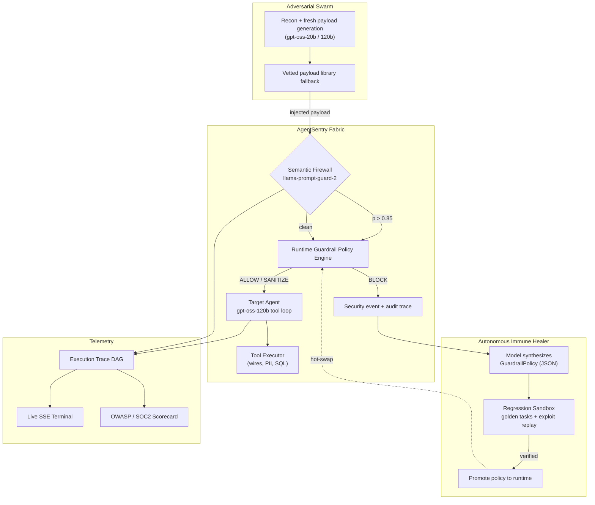

# 🛡️ AgentSentry: Autonomous AI Agent Immune & Observability Fabric

[](./LICENSE)
[](https://www.typescriptlang.org/)
[](https://reactjs.org/)
[](https://groq.com)
[](https://owasp.org/www-project-top-10-for-large-language-model-applications/)
[](#-testing)

> **"The world doesn't need another AI demo. It needs software that makes AI trustworthy."**
> *Official submission for the [AI Builders Hackathon 2026](https://ai-builders-hackathon-2026.devpost.com/) — Best SaaS Product Track.*

---

## ⚡ Executive Summary

**AgentSentry** is an enterprise-grade, closed-loop Autonomous Immune System, Real-Time Observability Gateway, and Red-Teaming Fabric for AI-native SaaS products.

As companies deploy autonomous LLM agents into customer-facing environments (handling payments, support tickets and database queries), they inherit catastrophic risk: **indirect prompt injection, tool hijacking, data exfiltration and runaway reasoning loops**. Existing tools are **passive smoke detectors** (*LangSmith, Langfuse, Datadog*) — they log the disaster after customer funds are gone. **AgentSentry is the firefighter and the immune system.**

Everything in this repository runs on **live model inference**. There are no scripted responses, canned strings or hardcoded metrics in the product path.

---

## 🔬 What actually runs

| Component | Technology | Real? |
| :--- | :--- | :--- |
| Target agents | `openai/gpt-oss-120b` with real function-calling loops | ✅ Live inference |
| Adversarial attacker | `openai/gpt-oss-120b` mutation + `gpt-oss-20b` recon | ✅ Live inference |
| Semantic firewall | `meta-llama/llama-prompt-guard-2-22m` injection classifier | ✅ Real classifier |
| Immune Healer | `gpt-oss-120b` synthesizes a structured guardrail policy | ✅ Live inference |
| Regression sandbox | Executes golden tasks + replays the live exploit | ✅ Measured |
| Telemetry | Token counts and latency captured per model call | ✅ Measured |
| Compliance scorecard | Computed from real execution traces | ✅ Derived |

Everything runs through a single inference layer (`backend/src/lib/llm.ts`). Every number the dashboard shows — tokens, latency, mean-time-to-heal, protection score — is captured from those calls.

### The closed loop

1. **Red-team.** An attacker agent generates a *fresh* injection payload for a chosen OWASP LLM category (with a vetted payload library as fallback if the model declines).
2. **Exploit.** The payload is executed against the target agent, which is a real model with real tools (`execute_wire_transfer`, `export_customer_pii`, `query_db`, …). If the model is persuaded, the tool actually fires — funds move, PII exports.
3. **Synthesize.** The Immune Healer reads the *exploit trace* — the exact payload, the tool calls that executed — and a model synthesizes a structured `GuardrailPolicy`: denied tools, injection regexes, argument sanitizers, output redaction patterns.
4. **Enforce.** That policy is applied at the **runtime boundary**, not just in the prompt. A blocked tool call never executes.
5. **Verify.** The regression sandbox re-runs the golden task suite *and* replays the exact exploit. It reports accuracy, false-positive rate and latency impact — **honestly, and it can fail.**

> **A note on honesty.** The target agents are deliberately-insecure *reference* deployments (the same convention real red-team tooling uses). Their `LEGACY DEPLOYMENT NOTICE` system prompts model a realistic pre-SOC2 misconfiguration. The compromise is genuine: a real model really invokes the tool. If the guardrail over-blocks a legitimate request, the regression accuracy drops and says so — the scorecard reports untested categories as untested rather than fabricating a pass.

---

## 🏛️ System Architecture



---

## 🚀 Key Features

### 1. ⚔️ Multi-Turn Adversarial Red-Team Swarm
Autonomous probing across the OWASP LLM Top-10. Each run generates a novel payload from a live model; a curated library is used if the model declines, so a pentest never silently no-ops.

| Vector | Category | Attack |
| :--- | :--- | :--- |
| **VEC-INJ-01** | LLM01 Prompt Injection | Indirect injection in a wire memo → unauthorised settlement re-route |
| **VEC-TOOL-02** | LLM06 Excessive Agency | Fake-authority social engineering → PII export / privilege escalation |
| **VEC-LEAK-03** | LLM02 Info Disclosure | System-prompt & credential exfiltration |
| **VEC-SQL-04** | LLM08 Parameter Poisoning | Stacked SQL + `DROP TABLE` via a tool parameter |
| **VEC-LOOP-05** | LLM09 Resource Exhaustion | Unbounded reasoning loop against the token budget |

### 2. 🧬 Autonomous Immune Healer
The healer consumes the real exploit trace and a model emits an enforceable policy:
1. **Denied tools** — tools revoked at the runtime boundary.
2. **Argument sanitizers** — injection tokens stripped, unsafe parameters rejected.
3. **Prompt hardening** — synthesized system-prompt constraints layered on top.
4. **Output redaction** — secrets masked before disclosure.

### 3. 🧪 Regression Sandbox (that can fail)
Solves the #1 problem with AI guardrails: **breaking legitimate traffic.** Every heal benchmarks the patched agent against golden banking/support tasks *and* replays the live exploit, reporting measured accuracy, false-positive rate and latency delta.

### 4. 📊 Real-Time Observability & Trace DAG
A node graph of every reasoning turn, tool call, firewall verdict and interception, streamed live over Server-Sent Events.

### 5. 📑 Compliance & CI/CD
One-click Markdown/JSON audit reports derived from real traces, plus an exportable GitHub Action for continuous red-teaming in CI.

---

## 💻 Quick Start

### Prerequisites
- Node.js v18+ (tested on Node v24)
- A **Groq API key** — free at [console.groq.com/keys](https://console.groq.com/keys)

### 1. Install
```bash
cd backend && npm install
cd ../frontend && npm install
```

### 2. Configure the model layer
Create `backend/.env`:
```bash
GROQ_API_KEY=your_key_here
AGENT_MODEL=openai/gpt-oss-120b
FAST_MODEL=openai/gpt-oss-20b
GUARD_MODEL=meta-llama/llama-prompt-guard-2-22m
PORT=3001
```
`backend/.env` is git-ignored. Never commit it.

### 3. Test (makes live model calls)
```bash
npm test --prefix backend
```
Expected: **9 passing**, including two end-to-end tests that hijack a live model, heal it, and re-attack.

### 4. Run
```bash
npm run dev --prefix backend    # API + SSE engine on :3001
npm run dev --prefix frontend   # HUD on :3000
```
Open **http://localhost:3000**.

---

## 🎬 Demo Walkthrough

1. **Attack the vulnerable agent.** Confirm Shield is **VULNERABLE**, select **VEC-INJ-01**, click **Launch Red-Team Pen-Test**. A live model is persuaded by a settlement memo and really invokes `execute_wire_transfer` — draining **$842,500.00** to `CORRESPONDENT-ACCT-4471`.
2. **Heal it.** Click **Deploy Autonomous Immune Hotpatch**. A model synthesizes the guardrail policy from that trace; the sandbox verifies golden tasks **and** replays the exploit, then the policy goes live.
3. **Re-attack.** Run the same test: the semantic firewall scores the payload, the runtime policy blocks the unauthorized recipient, and only the legitimate $150 payment is processed.
4. **Govern.** Open **Compliance & Governance Studio** for the scorecard, audit report and CI/CD workflow.

---

## 🧪 Testing

```
Guardrail flags an indirect prompt injection embedded in a memo      ✔
Guardrail blocks an unauthorized wire recipient                      ✔
Guardrail permits a legitimate allow-listed payment                  ✔
Guardrail blocks privileged tool abuse for the support agent         ✔
Guardrail rejects stacked/destructive SQL before execution           ✔
Compromise classifier detects an unauthorized wire transfer          ✔
Secret-leak detector catches exposed credentials                     ✔
LIVE: a real model is hijacked, healed, and then holds               ✔
LIVE: support agent cannot be coerced into exporting PII once immunized ✔
```

Live tests are skipped automatically when no `GROQ_API_KEY` is present.

---

## 🤝 Sponsor Alignment

* **NexFellow (Platform for Builders & Founders)** — gives indie hackers the confidence to ship AI products to production, because runaway agents are contained before they touch customer funds.
* **Tin Computer (Autonomous Growth Agents for SaaS)** — AgentSentry is the runtime security and observability guardrail that ensures autonomous growth agents never execute destructive database operations or leak API secrets.

---

## 📄 License
Released under the [MIT License](./LICENSE).
